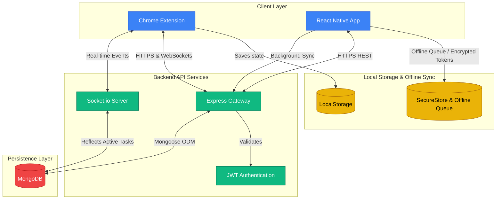

# Urgentify (SyncTask Ecosystem) 🚀

[](https://github.com/GITHUBAKSHATRAJ/Urgentify)
[](https://nodejs.org/)
[](https://reactnative.dev/)
[](https://developer.chrome.com/docs/extensions/)

**Urgentify** is a multi-platform productivity ecosystem designed to eliminate "deadline blindness." By leveraging real-time WebSockets, offline-first synchronization, and custom psychological cues (dynamic color-shifting based on urgency), Urgentify ensures you never miss a critical task again.

The ecosystem comprises three primary components:
1. **[Backend API](./backend/)**: A stateless Node.js/Express & MongoDB server handling JWT Auth, CRUD operations, and WebSocket communication.
2. **[Chrome Extension Client](./extension/)**: A React 18 / Vite Google Chrome "New Tab" page extension acting as an overlay dashboard.
3. **[Mobile Client](./mobile/)**: A React Native (Expo) mobile app designed with the New Architecture (Fabric/Yoga), offline sync queues, and local notification alarms.

---

## 🗺️ System Architecture



---

## 📂 Project Structure

```text
Urgentify/
├── backend/            # Express, MongoDB, and Socket.io server
│   ├── src/            # Backend controllers, models, middleware, & routes
│   └── docsJWT.md      # In-depth architectural review of stateless Auth
│
├── extension/          # Chrome New-Tab React 18 overlay client
│   ├── src/            # Controlled dashboard components and layout rules
│   └── dist/           # Built extension bundle loaded by Manifest V3
│
├── mobile/             # React Native (Expo) mobile client
│   ├── src/            # Layouts, hooks, and native-bridged utilities
│   ├── android/        # Self-healing gradle configurations
│   └── challenges.md   # Troubleshooting log for build/emulator setup
│
└── projectDoc.ipynb    # Jupyter research notebook containing design notes
```

---

## ⚙️ Quick Start & Local Installation

To run the entire ecosystem locally on your development machine, follow the steps below.

### 1. Run the Backend Server
First, spin up the API gateway and WebSocket server.

```bash
# Navigate to the backend directory
cd backend

# Install server dependencies
npm install

# Configure environment variables (.env)
cp .env.example .env # or create manually:
# PORT=5000
# MONGO_URI=mongodb://127.0.0.1:27017/urgentify
# JWT_SECRET=your_secret_key
# NODE_ENV=development

# Start the server in development mode
npm run dev
```
*The server will listen at `http://localhost:5000`.*

---

### 2. Build and Load the Chrome Extension
Because extensions run directly inside Chrome's sandbox, you must compile the package and load it unpacked.

```bash
# Navigate to the extension directory
cd ../extension

# Install dependencies
npm install

# Build the Manifest V3 dist bundle
npm run build
```

#### How to load into Chrome:
1. Open Google Chrome and visit `chrome://extensions/`.
2. Enable **Developer Mode** (toggle in the top-right corner).
3. Click **Load unpacked** in the top-left corner.
4. Select the output `dist` folder (`Urgentify/extension/dist`).

---

### 3. Run the Mobile App (Android / iOS)
The mobile app runs on React Native with the new C++ rendering engine.

```bash
# Navigate to the mobile directory
cd ../mobile

# Install mobile dependencies
npm install

# Start the Expo development server
npx expo start
```
*Press `a` in your terminal to open the app on your Android Emulator, or `i` for iOS Simulator.*

> [!TIP]
> If you run into Android build issues or `JAVA_HOME` configuration errors, refer to the detailed [Mobile Troubleshooting Log](./mobile/challenges.md) for quick-fix scripts.

---

## 💡 Key Design Patterns
* **Stateless Token-Based Authentication**: Custom JSON Web Token (JWT) workflow protecting Express routes and verified inside clients securely.
* **Fabric & Yoga UI Lifecycle**: The mobile app utilizes C++ rendering (Fabric) and Flexbox calculations (Yoga) directly bridging layout instructions to native devices.
* **Offline-First Syncing Queue**: If the mobile device loses internet connection, mutations are queued locally and synchronized automatically in the background once connection resumes.
* **Dynamic Psychological Cues**: Tasks transition color states dynamically (from calm teal to urgent red) as deadlines approach, updating synchronously across Chrome and Mobile.

---

## 🤝 Contributing & Guidelines
Please ensure that you check:
* [CLAUDE.md](./mobile/CLAUDE.md) for local script triggers.
* [challenges.md](./mobile/challenges.md) for setup guides.
* Do not commit local `.env` configuration keys to GitHub repository branches.
