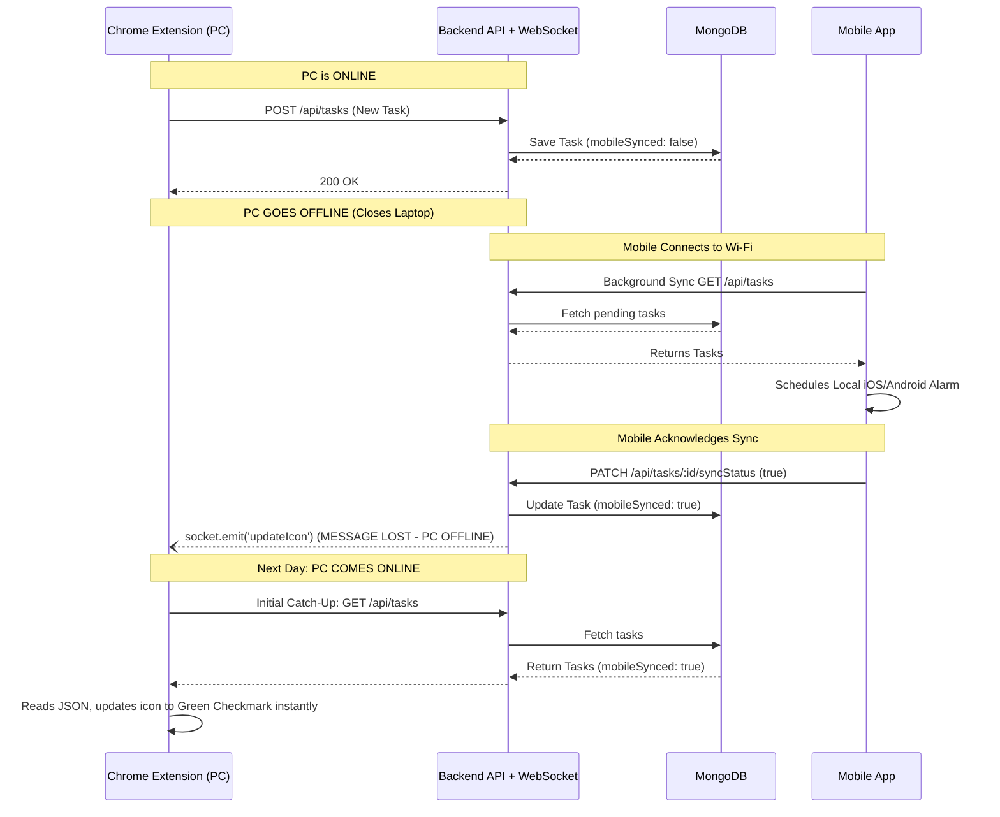

# WebSocket & MongoDB Sync Architecture

This is a fantastic edge-case question, and it is exactly why you still need **MongoDB** working alongside your WebSockets!

If the Chrome Extension goes offline, the WebSocket connection is broken. WebSockets **do not** remember messages for clients that are offline. If the server broadcasts a message to an offline client, that message simply vanishes.

This is why the **Database is your Single Source of Truth**, and the WebSocket is just a fast messenger. Here is exactly how your architecture handles this edge case:

### The Step-by-Step Workflow

**1. Extension Creates Task:**
You create the task on your PC. It hits the backend, and the backend saves it in MongoDB with a default field: `mobileSynced: false`.
*(Immediately after this, you close your laptop, and the Extension goes offline).*

**2. Mobile Connects & Syncs:**
Hours later, your phone connects to Wi-Fi. The background sync runs, fetches the new task from the backend, and schedules the local alarm on your phone.

**3. Mobile Updates the Database:**
The mobile app hits a backend endpoint (e.g., `PATCH /api/tasks/:id/syncStatus`). The backend goes into MongoDB and updates the task: `mobileSynced: true`.

**4. The Server Attempts to Broadcast:**
The backend sees the database update and says: *"Okay, I need to tell the Chrome Extension!"* It fires the WebSocket broadcast: `socket.emit('updateExtensionIcon', ...)`
Because your laptop is closed and offline, **nothing happens**. The WebSocket message is lost, but that is perfectly okay because the truth is safely stored in MongoDB!

**5. The Extension Comes Back Online:**
The next day, you open your laptop. The Chrome Extension reconnects to the internet. 

**6. The Initial Catch-up (The Solution):**
Whenever any client comes online and opens your app, the very first thing it must do is run a standard `GET /api/tasks` REST call to catch up on what it missed while it was sleeping. 
The backend sends the list of tasks. The Chrome Extension reads the JSON data, sees that `mobileSynced` is now `true` for that task, and updates its icon to the green checkmark instantly.

---

### Summary of the Golden Rule:
*   **MongoDB** is used to permanently store the status (`mobileSynced: true`).
*   **WebSockets** are ONLY used to instantly update the screen IF the user happens to be looking at both devices at the exact same time. 
*   If a device is offline during a WebSocket broadcast, it simply catches up by reading the database the next time it connects.

---

## 🌊 Architecture Sequence Diagram

This diagram visualizes the offline/online edge-case where WebSockets fail to deliver the message, but the Database acts as the reliable fallback.



---


## 💡 WebSockets: Advanced FAQs

### FAQ: How do I secure WebSockets with my JWT system?
When you make a standard HTTP request, you put the JWT in the `Authorization` header. WebSockets, however, start with a handshake. 
**Solution:** You pass the JWT token in the connection query string or as an auth payload during the initial socket connection. 
```javascript
// Client side
const socket = io('http://localhost:5000', {
  auth: { token: 'YOUR_JWT_STRING' }
});

// Server side (Middleware)
io.use((socket, next) => {
  const token = socket.handshake.auth.token;
  try {
    const decoded = jwt.verify(token, process.env.JWT_SECRET);
    socket.user = decoded; // Attach user to socket safely
    next();
  } catch (err) {
    next(new Error('Authentication error'));
  }
});
```

### FAQ: What happens if the backend server crashes or restarts?
WebSockets are a persistent connection. If your Node.js server restarts (e.g., during a deployment), all WebSocket connections instantly break.
**Solution:** Libraries like `socket.io` handle this automatically on the client side. When the server comes back up, `socket.io-client` will automatically try to reconnect in the background. Once reconnected, the client should run a quick REST API fetch to grab any data it missed while the server was down.

### FAQ: Will WebSockets drain the Mobile App's battery?
Yes, keeping a persistent WebSocket connection open 24/7 on a mobile phone will drain the battery, and iOS/Android will forcibly kill the process in the background anyway.
**Solution:** You should only keep the WebSocket connection open when the Mobile App is in the **foreground** (the user is looking at the screen). When the app minimizes, close the socket and let your `expo-background-fetch` polling take over the background sync.

### FAQ: How do WebSockets scale if I have multiple backend servers?
If your app scales massively, you might run 3 instances of your Node.js backend. If your Mobile App connects to Server A, and your Chrome Extension connects to Server B, they cannot communicate over standard WebSockets!
**Solution:** You must implement a **Redis Pub/Sub Adapter**. When Server A receives a message from the mobile app, it publishes the message to Redis. Redis instantly forwards it to Server B, which then emits it to the Chrome Extension.
