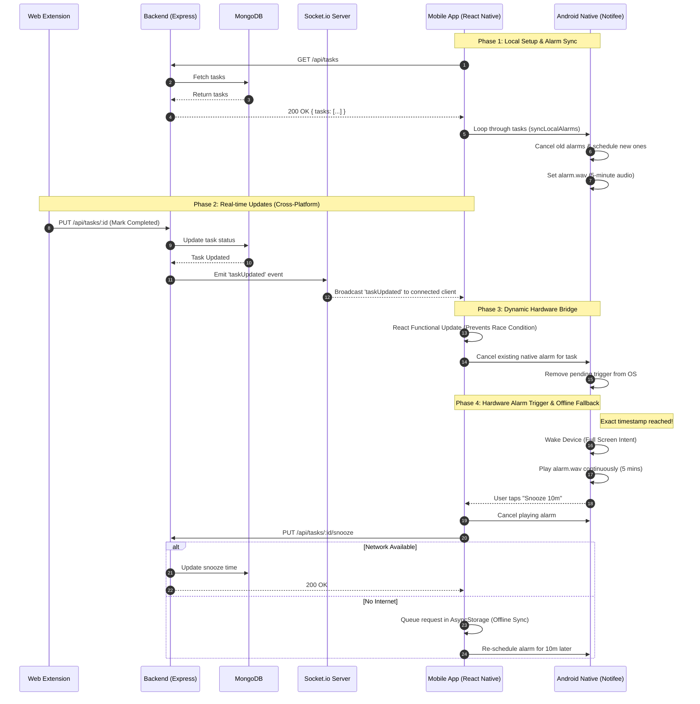

# Urgentify App - High Level Design (HLD) Workflow

This document outlines the end-to-end architecture and data flow of the Urgentify application, connecting the Mobile App, Web Extension, Backend API, WebSockets, and the Native Android Notification Engine.

## Mermaid Flowchart
You can copy the code block below and paste it directly into [Mermaid Live Editor](https://mermaid.live/) or [Mermaid AI](https://mermaid.ai) to visualize the architecture.

## Detailed Workflow Breakdown

### 1. The Cross-Platform Real-Time Sync Loop
1. The **User** interacts with the **Web Extension** on their computer to quickly mark a task as completed.
2. The Web Extension sends a REST API `PUT` request to the **Backend (Node.js)**.
3. The Backend updates **MongoDB** and immediately fires a trigger to the **WebSocket Server (Socket.io)**.
4. The WebSocket Server instantly broadcasts a `taskUpdated` event to all connected clients.
5. The **Mobile App** (which is listening quietly in the background or foreground) catches this event inside `Dashboard.js`.
6. Using **React Functional State Updates** (`setTasks(prev => ...)`), the app updates its local UI instantly without stuttering or encountering race conditions.

### 2. The Native Hardware Notification Bridge
1. Every time the task list is updated (either locally or via WebSockets), the `syncLocalAlarms()` function is called.
2. The logic calculates the exact timestamp the alarm should go off based on the user's custom warning offset (e.g., "15 minutes before deadline").
3. The app communicates across the React Native Bridge to **Notifee**, configuring a custom **Android Notification Channel** designed specifically for alarms (`AndroidCategory.ALARM`, `AndroidImportance.HIGH`).
4. This channel has special permissions to bypass the phone's **Do Not Disturb** mode.
5. When the exact timestamp arrives, the phone wakes up automatically via a Full-Screen Intent.
6. The phone plays the native resource `alarm.wav` (which we generated as a 5-minute continuous loop file) loudly through the alarm audio stream.

### 3. The Offline Fallback Mechanism
1. If the user's phone has no internet connection, and the alarm goes off.
2. The user taps "Acknowledge" or "Snooze".
3. The app attempts to send an HTTP request to the Backend to sync this action.
4. If the request fails due to no network, the app sends the action to the **Offline Sync Engine**, which saves the pending request in `AsyncStorage`.
5. The local Notifee alarm is safely canceled so it stops ringing.
6. Once the phone regains cellular/WiFi connection, the app flushes the offline queue, syncing the Snooze/Acknowledge states back to the database.
